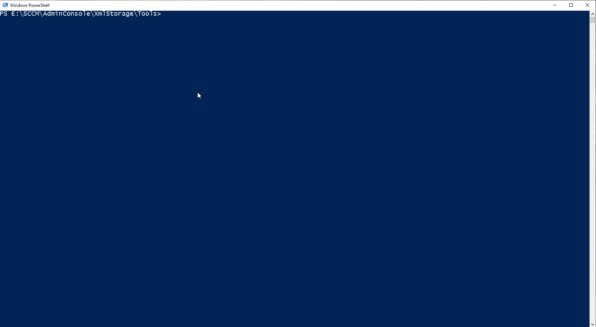
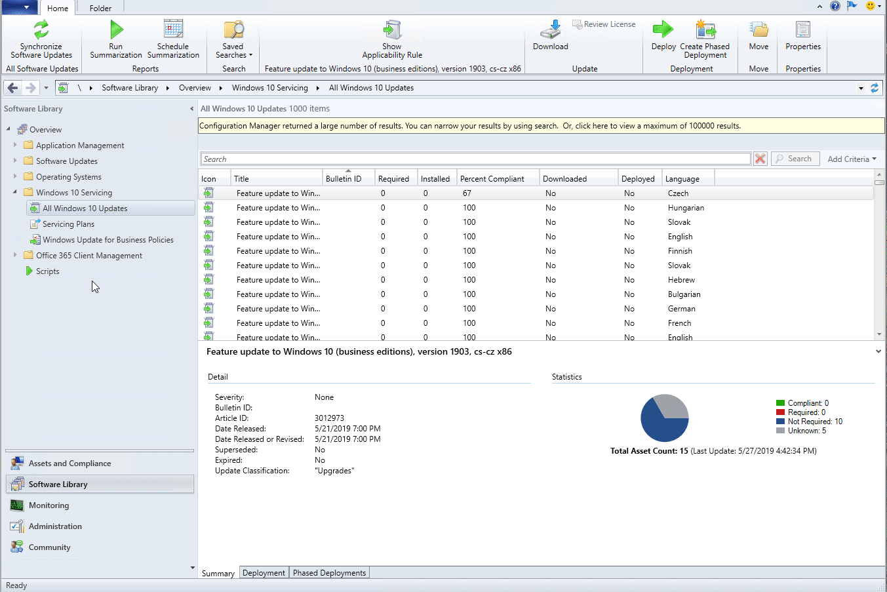

# Show Applicabiltiy Rule

# Introduction

Windows Updates have Applicability Rules, that decide whether an update is installable or is installed. This information can be very useful in Troubleshooting cases and to understand why a updates report back installed or why a updates is not installing.
These Rules are defined in the Update.xml per Update. The Update.xml is stored in the WSUS Update Database in the RootElementXmlCompressed filed of the table tbxml.  An update can be bundled. Therefore the bundled update xml needs to be looked at.
Show-ApplicabilityRule.ps1 will help you to extract the Applicability Rule.

## Script Stand alone



```powershell
.\Show-ApplicabilityRule.ps1 -SQLServer sql1.ifish.local -SQLDBName SUSDB -UpdateSearchString "%Office 365 Client Update - First Release for Current Channel Version 1706 for x64 based Edition (Build 8229.2056)%"
```

## SCCM Console Extension installation



* Copy ShowApplicabilityRule.xml and Show-ApplicabilityRule.ps1 to a folder on the machine where you have the console installed
* Change sql server in ShowApplicabilityRule.xml
* Run install script below

```powershell
#Create and Copy Script to Tools Folder

$ToolsFolder = New-Item -Path "$($ENV:SMS_ADMIN_UI_PATH)\..\..\XmlStorage\" -Name "Tools" -ItemType "directory"
Copy-Item .\Show-ApplicabilityRule.ps1 $ToolsFolder

#Create GUID Folder and copy ShowApplicabilityRule.xml
$Guids =  ("Office_365_Updates", "ef93deea-a0bc-4f36-9b48-a510ac5340eb"),
          ("All_Software_Updates","5360fd7a-a1c4-428f-91c9-89a4c5565ce1"),
          ("All_Windows_10_Updates", "6d833cef-aa77-4018-943c-627979f5905c") | ForEach-Object {[pscustomobject]@{Name = $_[0]; Guid = $_[1]}}


Foreach ($Guid in $Guids) {
  Write-Host "Create Extension  for $($Guid.Name)"
  $Guid = New-Item -Path "$($ENV:SMS_ADMIN_UI_PATH)\..\..\XmlStorage\Extensions\Actions" -Name "$($Guid.Guid)" -ItemType "directory" -Force
  Copy-Item .\ShowApplicabilityRule.xml $Guid

}
```

# TODO

- [ ] replace temp file workaround in powershell script
- [ ] uninstallation routine
- [ ] Autdetection of SUS SQL and DB
- [ ] Test with WID (Windows Internal Database)
- [ ] Test in Multi SUS Environment
- [x] Better view of the Applicability Rule
- [x] SQL Command Error Handling

# Contribute

Anyone just ping me
